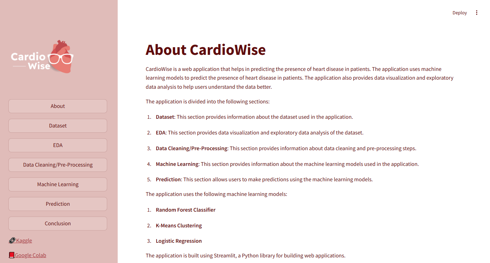

# CardioWise

CardioWise is a web application that helps in predicting the presence of heart disease in patients. The application uses machine learning models to predict the presence of heart disease in patients. The application also provides data visualization and exploratory data analysis to help users understand the data better. 

The application is divided into six sections:
* About
* Dataset
* Data Cleaning/Pre-Processing
* Machine Learning
* Prediction
* Conclusion

It uses Supervised and Unsupervised model to further make predictions or cover patterns in unlabeled data. The application uses the following machine learning models:
* Random Forest Classifier
* Logistic Regression
* K-means Clustering

Note: This is not advisable to use this application for any medical reason. This is just a way to predict heart disease patients from the chosen dataset and to practice analytical skills. 

Google Colab Notebook: https://colab.research.google.com/drive/1e9-VZ7SC9UazttzGxRSMWlsQk67_4rLZ?usp=sharing
Kaggle link: https://www.kaggle.com/datasets/shantanugarg274/heart-prediction-dataset-quantum